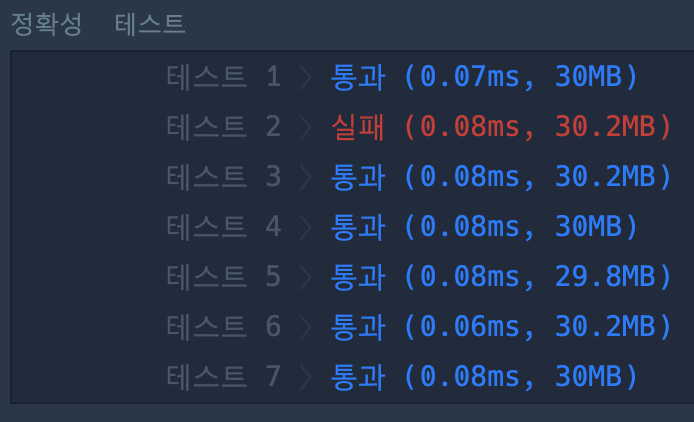

나는 진짜 바보다..
이력 좋아도 코딩테스트 때문에 떨어지는
놈이 있따면 내가 아닐까?

[K번째수]

라는 코딩테스트 문제를 풀다가.


위와 같이 테스트 1개만 안되는 문제가 발생,,

아래 링크 내용을 참고하여

[K번째수 실패이유](https://programmers.co.kr/questions/14959)

```javascript
sort();
sort((a, b) => a - b); //로 변경!
```

위와 같이 sort() 함수의 인자를 명시하였고, 다시 테스트케이스를 진행시켜 보았더니
잘 해결되었다! 😭따흑

[해당 이슈 관련 mozilla 링크](https://developer.mozilla.org/ko/docs/Web/JavaScript/Reference/Global_Objects/Array/sort)
